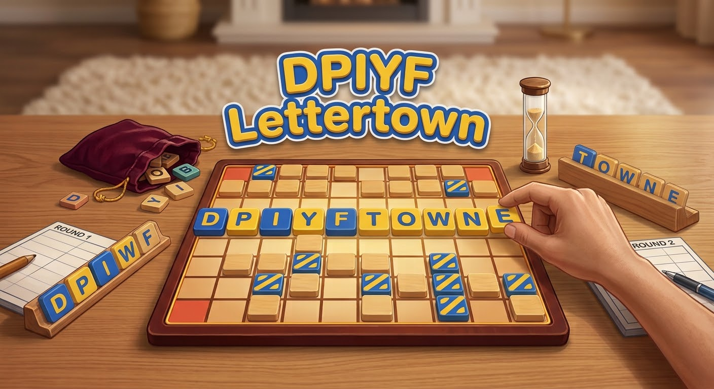

# DPIYF Lettertown



A daily word puzzle that mixes three classics:

- **Spelling Bee**: 7 distinct letters, a required key letter, a pangram jackpot and a rank ladder.
- **Boggle**: words are traced through *adjacent* tiles, and no tile is reused within a word.
- **Scrabble**: letters carry Scrabble values and some tiles are premium (DL, TL, DW).

Built with Vite, React, TypeScript and Tailwind. No backend: every device builds the same board from the date.

```sh
npm install
npm run dev        # local dev server
npm test           # Vitest suite
npm run build      # typecheck + production build into dist/
```

It's a static site, so it can be hosted anywhere (see [Deploying](#deploying)). Add `?date=YYYY-MM-DD` to play any day's board, and `#blitz` to open Blitz.

## Rules

| | |
|---|---|
| Board | Hex grid of radius 2 (19 tiles). Letters can repeat. Boards from 2026-09-27 aren't limited to 7 different letters; harder days add more. |
| Key tile | The gold centre tile. Every word must include it (as any letter). It is never a premium tile. |
| Premiums | 3–4 tiles per board: DL (double letter), TL (triple letter), DW (double word). |
| Words | 4+ letters, a path of adjacent tiles, each tile used only once per word, in the word list. Each word counts once. |
| Pangram | Any word with 7 or more different letters. Every board has at least one that can be traced through the key tile. |

**Scoring:** `sum(letter value × letter multiplier) × word multipliers` (DWs stack), then +1 per letter beyond four. A pangram adds 25, then the total doubles. Each word is scored along its **best route** on the board however you entered it, so the maximum score is well defined and typing is never worse than tracing.

**Ranks** (share of the day's maximum): Tourist 0% · Newcomer 10% · Local 25% · Wordsmith 45% · Town Crier 65% · Mayor 80% · **Key to the City** 100%.

## Weekly difficulty

From 2026-09-27, daily boards follow a weekly curve from **Monday (Easy)** to **Sunday (Hardest)**: fewer words, more and rarer extra letters, and fewer vowels as the week goes on. Tuning lives in `TUNING` in `src/engine/generator.ts`. Older boards are unchanged.

## Playing

- **Tap** tiles one by one or **drag** across them; drag back onto the previous tile to undo a step. Tapping a tile already in the word cuts the word back to it.
- **Drag** and **let go** to submit, or after tapping, **tap the last tile again** or press **Enter**. Delete and Clear are below the board. There is no shuffle, because tile positions are the game.
- On a keyboard you can just type. The board highlights a route for the letters, and Backspace, Enter and Esc work.
- Rejections shake the board and give a reason: *Too short*, *Tiles not adjacent*, *Missing center*, *Not on board*, *Already found*, *Not a word*.
- **Hints** shows a Bee-style grid of how many words are left, by first letter and length.
- **Daily** is untimed and progress is saved in `localStorage` for each date. **Blitz** gives you a random board and 3 minutes, then shows every word you missed, and keeps your best score.
- **Share** sends a spoiler-free challenge with your score, rank and leaderboard place, plus the link. For example: `DPIYF Lettertown 9/28 (Easy)` / `🏆 #2 of 7 today · 412 pts · Mayor` / `⬢⬢⬢⬢⬢⬢⬡` / `Can you beat me? https://onthedcl.github.io/word-game-/`.
- Supported phones buzz lightly when you add a tile, find a word or make a mistake.

## Leaderboards

The GitHub Pages build points at the leaderboard Worker (`VITE_API_BASE` in the deploy workflow). The trophy button, name prompt and rank badge appear only when that server answers, so the game works either way.

New players get a welcome screen that asks for a leaderboard name (they can skip it and add one later from the trophy). The trophy shows **Today's puzzle** and **Blitz best** rankings.

- **Live:** an open leaderboard refreshes every 5 seconds. While you play, a badge next to your rank (e.g. 🏆 #3 of 12) updates after each word and every 15 seconds.

- A small API runs as a Cloudflare Worker with a Durable Object (`worker/`, logic in `server/`), the same setup as the Streets of Fury relay. The game calls it at `https://word-game-leaderboard.danlagstein.workers.dev`. See `worker/README.md` to deploy it.
- **Scores can't be faked.** The client only sends the words it found. The server looks them up in the puzzle's answer table (the build publishes these to `/scores/`), throws out anything that isn't an answer, and computes the score itself.
- **Daily:** progress posts a moment after each new word. Only today's puzzle (±1 day for time zones) is accepted, and a saved score never goes down.
- **Blitz:** ranked rounds use a board the server picks from a pre-built pool of 365. Results must come back within 3 minutes plus a short grace period, and only once per round. The board keeps each player's best score.
- **Notifications:** the owner can get a phone notification when people play (see `worker/README.md`).
- **Rerolls:** `src/engine/rerolls.ts` lists days whose daily board was replaced. The game, the answer tables and the leaderboard all follow it.
- **Names work like a login.** Each name belongs to one player and gets a 4-digit PIN, which is shown in the leaderboard. Typing your name on another phone or browser asks for the PIN, then brings back your player and today's words (the server keeps each player's found words and routes). Five wrong PINs lock the name for an hour. Names picked before PINs existed can be claimed once without one.
- Players are anonymous: a random id kept in the browser, plus a display name of 2–16 characters, checked against a profanity list.

## How boards are made

`src/engine/generator.ts` runs inside a Web Worker (`src/worker/`), so the UI never blocks.

1. The RNG is seeded with `YYYY-MM-DD#offset`. Blitz boards use a random seed.
2. A pangram (7 distinct letters, 7–10 long) is picked from the curated seed list. Letter sets are ordered with a fixed shuffle and day *N* starts at slot *N*, so letter sets don't repeat within the first year (a test checks this).
3. The pangram is laid along a random self-avoiding route that includes the centre tile.
4. The other tiles are filled from the same 7 letters, weighted by how often each letter appears in valid words (with a nudge toward vowels) and capped at 4 tiles per letter. A short, seeded hill-climb then swaps filler letters to get richer boards.
5. 3–4 premiums are placed off-centre.
6. A DAWG + DFS solver finds every word and its best route. A board is accepted only with **30–90 words**, at least one pangram, and a max score of 250–1500; otherwise the generator rerolls with the next seed offset.

Generation takes about 50 ms per board on average.

| Path | Purpose |
|---|---|
| `src/engine/hexgrid.ts` | Axial coordinates, adjacency map, route validation, geometry |
| `src/engine/scoring.ts` | Letter values, premiums, scoring, ranks |
| `src/engine/dawg.ts` | Compact dictionary loader and lookups |
| `src/engine/solver.ts` | Board solver and route finder |
| `src/engine/generator.ts` | Seeded generator with acceptance checks |
| `src/engine/game.ts`, `hints.ts`, `share.ts` | Submission rules, hint grid, share text |
| `src/worker/` | Web Worker and its promise-based client |
| `src/components/`, `src/App.tsx` | UI |

## Dictionary

`npm run build:dict` rebuilds `public/dict/` from the public-domain [ENABLE](https://github.com/dolph/dictionary) list. The list is limited to the 50k most frequent English words ([FrequencyWords](https://github.com/hermitdave/FrequencyWords)) so answers stay fair, and a blocklist removes profanity and slurs ([LDNOOBW](https://github.com/LDNOOBW/List-of-Dirty-Naughty-Obscene-and-Otherwise-Bad-Words)). Boards are built from the resulting ~24k common words (`words.dawg`), so they stay fair. Answers also include any ENABLE word seen at least 30 times in the full frequency list (`words-all.dawg`, ~70k words), plus their -s/-ed/-ing forms, so real but less common words like *tiled* and *sifts* count. Pangram seeds come from the 25k most common words. Daily boards from 2026-09-28 also put two different vowels next to the key tile.

`npm run sample -- 365` prints stats for the next year of boards.

## Deploying

**GitHub Pages:** `.github/workflows/deploy-pages.yml` tests and builds the site on every push to `main` (you can also run it by hand from the Actions tab), then publishes `dist/` to the `gh-pages` branch. Pages serves that branch at https://onthedcl.github.io/word-game-/. If Pages isn't on yet, go to **Settings → Pages** and set Source to **Deploy from a branch**, with branch `gh-pages` and folder `/ (root)`.

**Firebase Hosting:** `firebase.json` serves `dist/`. Run `npx firebase-tools login` once, then `npm run deploy:firebase -- --project <your-project-id>`.

**Leaderboard:** a Cloudflare Worker. See `worker/README.md`.
